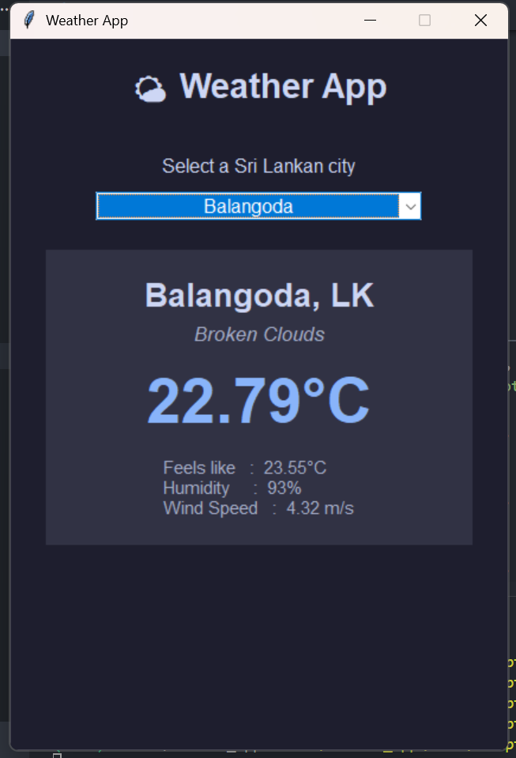

"# Sri Lanka Weather App" 
"" 
"Desktop application to get real-time weather conditions for all cities in Sri Lanka. Built with Python Tkinter and OpenWeatherMap API." 
"" 
"## Features" 
"- 50+ cities from all 9 provinces of Sri Lanka" 
"- Simple dropdown selection (no search bar required)" 
"- Displays temperature, feels like, humidity, wind speed, and weather description" 
"- Modern dark-themed GUI" 
"" 
"## Download Executable (Windows)" 
"Download the standalone .exe from [Releases](https://github.com/sudheera-hash/SriLankaWeatherApp/releases)" 
"" 
"## Run from Source" 
"1. Clone the repository" 
"2. Install dependencies: \`pip install -r requirements.txt\`" 
"3. Add your OpenWeatherMap API key to a \`.env\` file: \`WEATHER_API_KEY=your_key_here\`" 
"4. Run: \`python app.py\`" 
"" 
"## Technologies Used" 
"- Python 3" 
"- Tkinter (GUI)" 
"- OpenWeatherMap API" 
"- PyInstaller (for .exe)" 
"" 
"## License" 
"MIT" 
"" 
"" 
"" 
"## How to Run (from source)" 
"" 
"1. **Get a free API key** from [OpenWeatherMap](https://home.openweathermap.org/api_keys)" 
"2. **Clone this repository**" 
"3. **Create a \`.env\` file** in the project root with:" 
"   \`\`\`" 
"   API_KEY=your_api_key_here" 
"   \`\`\`" 
"4. **Install dependencies**: \`pip install -r requirements.txt\`" 
"5. **Run the app**: \`python app.py\`" 
